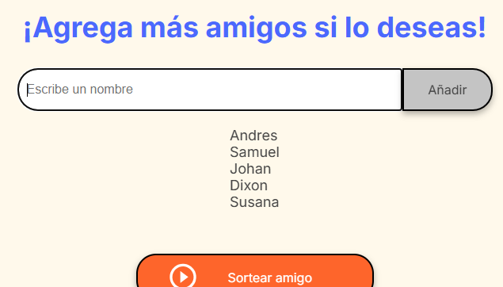
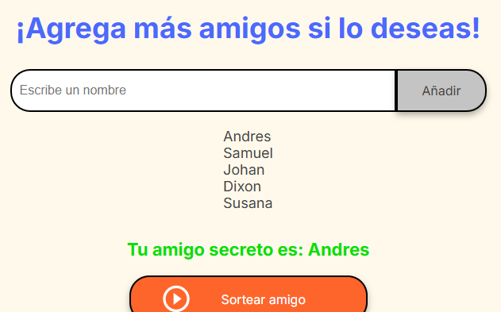
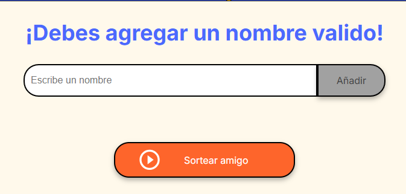
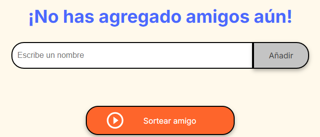

<h2>Juego amigo secreto - ONE - G8</h2>

Este es un juego del amigo secreto que hice en el Challenge del programa One next Education de Oracle junto a Alura Latam. G8

En este juego pude aplicar todos los conocimientos de lógica de programación que aprendí en los dos cursos que ofrecieron.

El programa lo hice totalmente desde cero, sin usar ningún tipo de IA ni ayuda en internet. Esto para desafiarme a mi mismo y realmente resolver un problema a partir del análisis.

El juego funciona muy simple, primero se dijitan los nombres de los amigos que van a participar, esto dentro del input.

Los participantes se van agregando a una lista visible debajo del input al presionar en el boton añadir

Luego cuando ya se agreguen los amigos, se presiona en el boton "Sortear amigo" para elegir de manera aleatoria el amigo secreto que le corresponde.

Además, agregué validaciones sumamente importantes, como asegurarme de que el usuario coloqué algo en el input, de lo contrario se le muestra este mensaje: 

Y coloqué una validación para cuando el usuario presione el boton "Sortear amigo" sin que aún se hayan agregado amigos a la lista, se le mostrará un mensaje en ese caso: 

El juego cumple con todos los requerimientos, y además me aseguré de usar buenas practicas. Sin duda el programa puede mejorar aún más. Estoy contento por haberlo hecho, tardé horas en resolverlo, pero sentí gran satisfacción al llegar a una solución sin ningún tipo de ayuda.

<h3>Gracias por leer - ¡A seguir programando!</h3>

Dixon Marino
