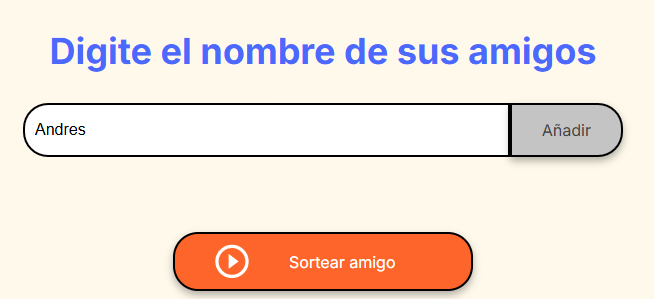

<h2>Juego amigo secreto - ONE - G8</h2>

Este es un juego del amigo secreto que hice en el Challenge del programa One next Education de Oracle junto a Alura Latam. G8

En este juego pude aplicar todos los conocimientos de lógica de programación que aprendí en los dos cursos que ofrecieron.

El programa lo hice totalmente desde cero, sin usar ningún tipo de IA ni ayuda en internet. Esto para desafiarme a mi mismo y realmente resolver un problema apartir del análisis.

El juego cumple con todos los requerimientos, y además me aseguré de usar buenas practicas. Sin duda el programa puede mejorar aún más. Estoy contento por haberlo hecho, tardé horas en resolverlo, pero sentí gran satisfacción al llegar a una solución sin ningún tipo de ayuda.

<h3>Gracias por leer - ¡A seguir programando!</h3>

Dixon Marino
